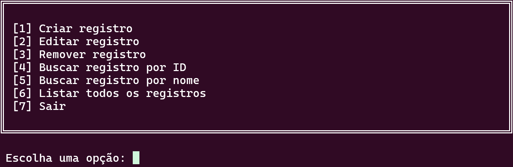
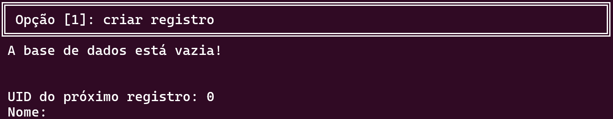
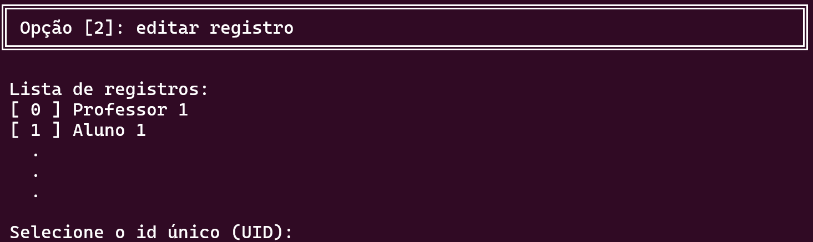
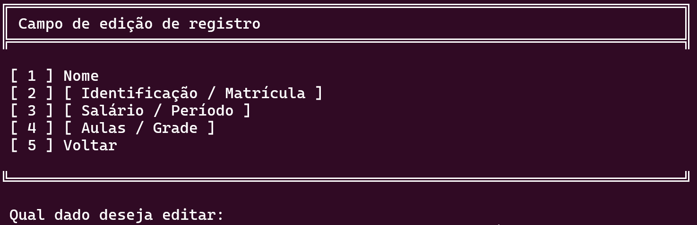
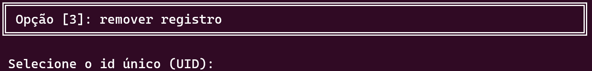
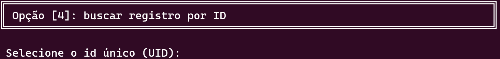
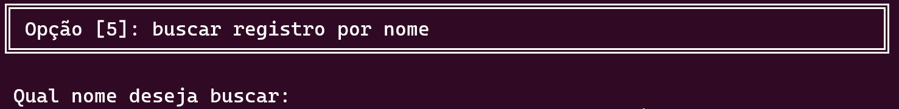
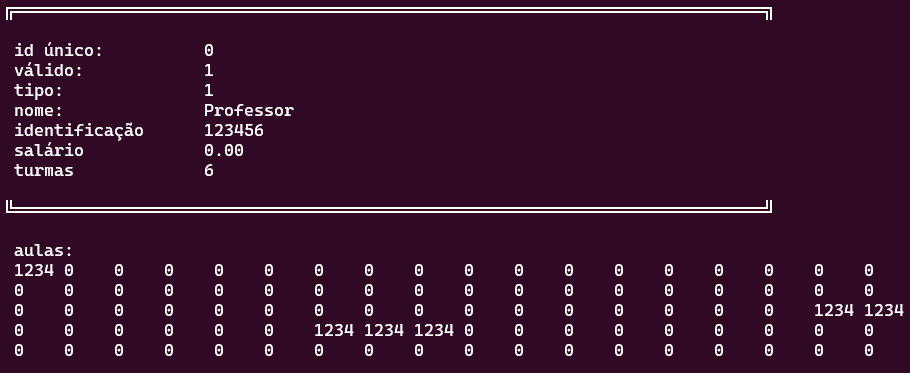
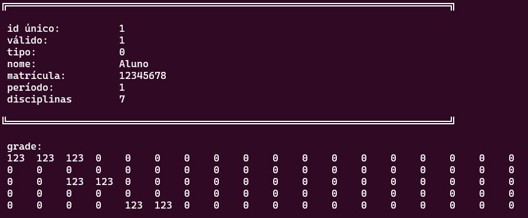

<!-- ```
╔═══════════════════════════════════════════════════════════════════════════╗
║                                                                           ║
║ ██    ██ ███    ██ ██     ██   ██ ███████ ██      ██████  ███████ ██████  ║
║ ██    ██ ████   ██ ██     ██   ██ ██      ██      ██   ██ ██      ██   ██ ║
║ ██    ██ ██ ██  ██ ██     ███████ █████   ██      ██████  █████   ██████  ║
║ ██    ██ ██  ██ ██ ██     ██   ██ ██      ██      ██      ██      ██   ██ ║
║  ██████  ██   ████ ██     ██   ██ ███████ ███████ ██      ███████ ██   ██ ║
║                                                                           ║
╚═══════════════════════════════════════════════════════════════════════════╝
``` -->

# MANUAL

Uni Helper é um programa pensado para facilitar o gerenciamento de discentes e docentes de uma universidade.

</br>

# Lista de Conteúdos

### [1 - Navegação](#navegação-↑)
### [2 - Opções](#opções--↑)
### [3 - Visualização](#visualização-↑)

</br>
</br>

## Navegação [↑](#1---navegação)


<!--```
╔═══════════════════════════════════════════════════════════════════════════╗
║                                                                           ║
║ [1] Criar registro                                                        ║
║ [2] Editar registro                                                       ║
║ [3] Remover registro                                                      ║
║ [4] Buscar registro por ID                                                ║
║ [5] Buscar registro por nome                                              ║
║ [6] Listar todos os registros                                             ║
║ [7] Sair                                                                  ║
║                                                                           ║
╚═══════════════════════════════════════════════════════════════════════════╝

 Escolha uma opção:
 ```-->

Ao iniciar Uni Helper, você será apresentado a esse menu.

Para usá-lo, basta digitar o número correspondente a opção desejada e confirmar com a tecla `enter`.

</br>

## Opções : [↑](#2---opções)

### [1 - Criar Registro](#criar-registro-↑)

Se for sua primeira vez usando Uni Helper, provavelmente é aqui que quer começar.\
Aqui, você irá inserir os dados que serão gravados no banco de dados.

### [2 - Editar Registro](#editar-registro-↑)

Digitou um dado errado, ou a situação de uma pessoa mudou? \
Esta opção irá permitir que você atualize os dados cadastrados de algum membro.

### [3 - Remover Registro](#remover-registro-↑)

Se a edição de um dado não for suficiente, você também pode removê-lo do banco de dados.

### [4 - Busca por ID](#busca-por-id-↑)

Esta opção permite que você consulte os dados cadastrados a partir do ID único gerado pelo programa.

### [5 - Busca por Nome](#busca-por-nome-↑)

Caso não saiba o ID único de um membro, você também pode realizar uma busca a partir do nome da pessoa.

### [6 - Listar Todos os Registros](#listar-todos-os-registros-↑)

Caso deseje consultar todos os registros cadastrados até então.\
Também pode ser útil se você não souber o ID nem o nome de um membro!

### 7 - Sair
Finaliza o programa.

<br>


## Criar Registro [↑](#1---criar-registro)


<!--```
╔═══════════════════════════════════════════════════════════════════════════╗
║ Opção [1]: criar registro                                                 ║
╚═══════════════════════════════════════════════════════════════════════════╝
 A base de dados está vazia!


 UID do próximo registro: 0
 Nome:
```-->
Ao escolher criar um registro, serão apresentadas três informações:

* Uma listagem de todos os registro cadastrados no momento
* O ID Único ( UID ) do novo registro
* O campo a ser preenchido

O primeiro dado a ser preenchido é o nome. _( É este que será considerado na [busca por nome!](#busca-por-nome) )_

Depois, você deverá definir o tipo do membro que será cadastrado, Professor, ou Aluno, cada um exige dados diferentes. _( Atenção! Uma vez escolhido, o cargo não pode ser editado sem a remoção completa do membro )_


### Dados por Cargo
[Professor:](#professor)
* Número de Identificação
* Salário
* Grade de salas de aula

[Aluno:](#aluno)
* Matrícula
* Período
* Grade de disciplinas

### Professor
Agora, você deve inserir o **número** de identificação institucional do professor.

O salário do docente; _( Atenção! Caso o salário inclua valores decimais use `.` para separar as casas )_

e, por fim, você poderá [adicionar salas de aula para a grade do docente.](#preencher-grades)

### Aluno
Agora, você deve inserir o **número** de matrícula do aluno;

O período atual do aluno;

e, por fim, você poderá [adicionar disciplinas para a grade do discente.](#preencher-grades)

### Preencher Grades
O processo para preencher uma grade é parecido para os dois cargos, a única diferença sendo o tipo dos elementos ( Salas de aula para Professores e disciplinas para Alunos ).

Primeiro, você deverá digitar o elemento que queira adicionar;

Então, você escolhe o dia da semana em que deseja adicionar o elemento. Os números de 1 a 5 representam os dias de Segunda a Sexta;

Após escolher o dia da semana, você precisará escolher o horário correspondente ao elemento. Os números de 1 ao 6 representam os horários da manhã, de 7 ao 13, os horários da tarde e de 14 ao 18, os horários da noite;

Após atribuir o elemento a um horário, você pode continuar preenchendo outros horários com o mesmo elemento.

Caso deseje voltar e escolher outro dia, basta inserir qualquer valor fora do intervalo esperado.

O mesmo pode ser feito durante a seleção de dias da semana, neste caso, ao voltar, você poderá decidir se quer adicionar outro elemento ou finalizar a inserção de dados.

_( Dica! Caso tenha inserido um elemento errado, você pode removê-lo substituindo o elemento indesejado por `0`.)_

### Visualização Imediata [↓](#visualização-↑)

Uma vez preenchido, você poderá rever todos os dados do membro adicionado.

<br>

## Editar Registro [↑](#2---editar-registro)


<!-- ```
╔═══════════════════════════════════════════════════════════════════════════╗
║ Opção [2]: editar registro                                                ║
╚═══════════════════════════════════════════════════════════════════════════╝

 Lista de registros:
 [ 0 ] Professor 1
 [ 1 ] Aluno 1
   .
   .
   .

 Selecione o id único (UID):
``` -->

Ao escolher editar um registro você será apresentado a uma lista com todos os registros criados até então ao lado de seus IDs e um campo para inserir o ID Único do registro.

Após escolher um registro, você poderá ver os dados atuais deste membro e o seguinte menu:


<!-- ```
╔═══════════════════════════════════════════════════════════════════════════╗
║ Campo de edição de registro                                               ║
╠═══════════════════════════════════════════════════════════════════════════╣

 [ 1 ] Nome
 [ 2 ] [ Identificação / Matrícula ]
 [ 3 ] [ Salário / Período ]
 [ 4 ] [ Aulas / Grade ]
 [ 5 ] Voltar

╚═══════════════════════════════════════════════════════════════════════════╝

 Qual dado deseja editar:
``` -->

_( Atenção! Opções 2, 3 e 4 variam de acordo com o cargo do membro registrado. )_

Aqui, você pode editar o dado correspondente a opção escolhida.

O processo de editar um dado é o mesmo que o preenchimento.

### 1 - Nome
Permite que você altere o nome vinculado ao registro.

### 2 - Identificação / Matrícula
Permite que você altere o número de identificação institucional do discente ou docente.

### 3 - Salário
Permite que você altere o salário vinculado a um docente.

### 3 - Período
Permite que você altere o período vinculado a um discente.

### 4 - Aulas / Grade
Permite que você insera ou remova elementos da grade.

[O processo de edição é o mesmo que o de preenchimento!](#preencher-grades)

A única diferença é que, ao remover, você não irá informar o número de um elemento, apenas a posição.

<br>

## Remover Registro [↑](#3---remover-registro)

<!-- ```
╔═══════════════════════════════════════════════════════════════════════════╗
║ Opção [3]: remover registro                                               ║
╚═══════════════════════════════════════════════════════════════════════════╝

 Selecione o id único (UID):
``` -->

Aqui você consegue remover um registro do banco de dados.

Basta informar o ID Único do registro.

Para as próximas operações, o registro aparecerá como `**Removido**`.

_( Atenção! Registros removidos podem ser preenchidos novamente através do [menu de edição](#editar-registro). Todos os dados deverão ser preenchidos novamente.)_

<br>

## Busca por ID [↑](#4---busca-por-id)

<!-- ``` 
╔═══════════════════════════════════════════════════════════════════════════╗
║ Opção [4]: buscar registro por ID                                         ║
╚═══════════════════════════════════════════════════════════════════════════╝

 Selecione o id único (UID):
``` -->
Ao inserir um ID Único, os dados do membro correspondente serão exibidos.

<br>

## Busca por Nome [↑](#5---busca-por-nome)

<!-- ```
╔═══════════════════════════════════════════════════════════════════════════╗
║ Opção [5]: buscar registro por nome                                       ║
╚═══════════════════════════════════════════════════════════════════════════╝

 Qual nome deseja buscar:
``` -->
Ao digitar um nome, todos os registros com um nome correspodente serão exibidos.

<br>

## Listar Todos os Registros [↑](#6---listar-todos-os-registros)

<!-- ```
╔═══════════════════════════════════════════════════════════════════════════╗
║ Opção [6]: listar todos os registros                                      ║
╚═══════════════════════════════════════════════════════════════════════════╝
*dados*
``` -->
Ao escolher esta opção, todos os registros armazenados são exibidos.

</br>


## Visualização [↑](#3---visualização)
Seja ao criar, editar ou listar um registro, Uni Helper apresentará uma representação visual dos dados listados.
Para professores, os dados serão apresentados como:



Para alunos:



O primeiro dado (comum a ambos os tipos) é o ID Único, definido automaticamente pelo programa;\
O segundo deverá sempre aparecer como 1! Significa que o registro não foi removido ainda;\
O terceiro é o tipo do registro e deverá ser igual ao escolhido durante a criação;\
*(Estes três dados inciais são imutáveis e serão sempre os mesmos enquanto o registro não for removido!)*

O quarto é o nome, este corresponderá a atualização mais recente feita ao nome do registro;\
*(É este o nome que você deverá buscar quando usar a [Busca por Nome](#busca-por-nome-↑))*

Os próximos dados podem variar de acordo com o tipo de registro sendo visualizado;\
O quinto dado é o número de identificação do docente ou a matrícula do discente;\
O sexto é o salário do docente ou o período em que se encontra o discente;\
O sétimo é a quantidade de horários ocupados na grade de aulas do docente ou discente;

Por fim, é apresentada a grade;
É importante entender a sua estrutura!

Pode-se imaginar a grade como uma matriz, cada uma das 5 linhas corresponde a um dia da semana (de segunda a sexta), enquanto as 18 colunas correspondem aos turnos daquele dia;
Da 1ª coluna até a 6ª devem estar cadastrados as aulas/disciplinas referentes ao turno da manhã;\
Da 7ª até a 12ª as aulas/disciplinas referentes ao turno da tarde;\
E da 13ª até 18ª as aulas/disciplinas referentes ao turno da noite!

E, com isso, você será capaz de entender os dados apresentados durante a visualização de um registro!